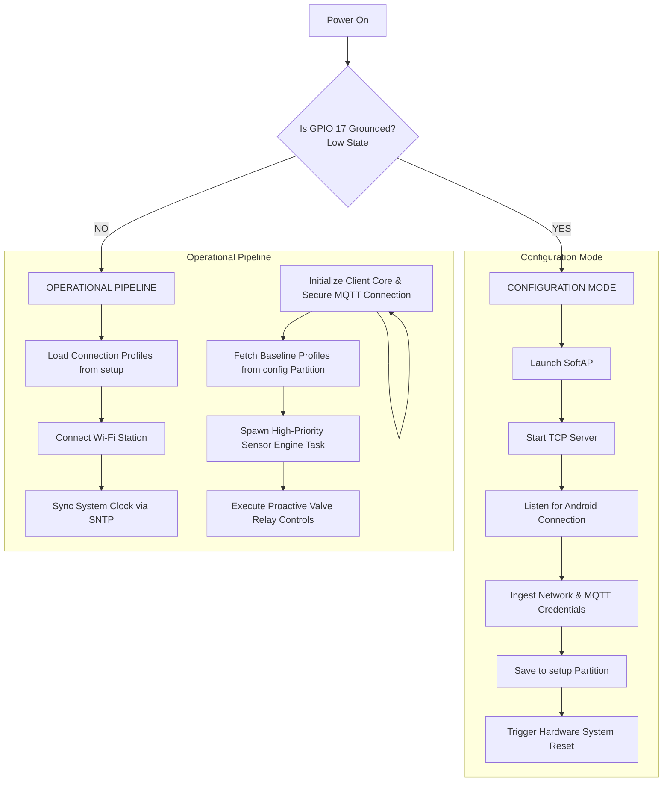

# Smart Irrigate — High-Level Design (HLD)

---

## 1. Project Description
**Smart Irrigate** is an automated, low-power irrigation controller engineered for the **ESP-IDF 6.0 framework** running on the ESP32-C6 FireBeetle 2 platform. The device acts as an intelligent edge-computing node that monitors microclimate variables, tracks live hydraulic line pressure data, and manages a matrix of physical AC water valves using an external relay array.

The software architecture leverages ESP-IDF 6.0 optimizations—such as the memory-efficient **Picolibc standard library**—to run proactive edge-logic routines. Smart Irrigate transitions between two software-controlled lifecycles evaluated at boot time:
* **Configuration Mode:** Triggered manually by holding down a physical button interface during boot. The device suspends monitoring and spins up a native local Wi-Fi Access Point (SoftAP) alongside a raw **TCP socket listening server**. A dedicated Android app connects directly to this host network, exchanging structured string payloads to populate network credentials and MQTT infrastructure layouts. The TCP server parses these properties, commits them into a dedicated Non-Volatile Storage (NVS) communication partition, and issues a hardware system restart.
* **Operational Mode:** The standard execution pathway. The device extracts connection profiles from the communication NVS partition, connects to the network via Wi-Fi Station mode, updates its clock via SNTP, and establishes a persistent, secure session with an upstream MQTT broker. A real-time engine concurrently samples physical data from the sensor array, packages the values, and streams them to the broker. Concurrently, the system acts upon incoming remote valve command structures, logging execution timelines and tracking irrigation events in real time.

---

## 2. High-Level Operational Logic Diagram

---

## 3. Core Concepts & Operational Logic

### 3.1 Predictive & Macro-Environmental Irrigation Control
Smart Irrigate explicitly avoids relying on a high density of localized ground moisture probes. Because ground sensors only reflect moisture in a very localized, narrow radius, they fail to account for the broader macro-environmental variables driving true plant transpiration and soil evaporation. Instead, this system utilizes an advanced atmospheric and thermal tracking approach to calculate total water demand:
* **Evapotranspiration & Microclimate Analysis:** Rather than measuring stagnant ground moisture, the device continuously samples ambient air temperature, relative humidity (via the SHT41), and barometric pressure (via the BMP581). By combining these real-time data streams, the system monitors the vapor pressure deficit (VPD) and thermal conditions that directly influence how fast plants lose water and how quickly the ground dries up.
* **Solar Load Quantification:** To prevent identical watering behaviors on overcast versus clear days, the system utilizes a high-dynamic-range digital light sensor (TSL2591) to capture both visible and infrared light intensities. This real-time solar irradiance data allows the edge logic to accurately model solar energy accumulation across the landscape zone.
* **Thermal Inertia & Soil Mass Tracking:** A ruggedized, single-point digital thermometer (DS18B20) is deployed just below the topsoil layer. This serves as a thermal anchor, tracking core soil temperature trends against rapid shifts in air temperature to accurately determine evaporation behavior influenced by soil thermal mass.
* **Boundary Layer Evolution (Future Wind Speed Expansion):** To account for wind stripping away the humid leaf boundary layer and spiking transpiration rates, the architecture reserves hardware processing nodes for a future anemometer interface. Until physical integration occurs, boundary layer wind dynamics are optionally supplemented via inbound regional data profiles over the MQTT layer.
* **Barometric Weather Prediction & Seasonal Inflection Tracking:** The system monitors short-term barometric pressure tendencies using the BMP581 to anticipate regional rain fronts, adjusting upcoming irrigation volumes dynamically. On a macro-scale, the device cross-references its real-time atmospheric tracking with historical trends sent via the MQTT broker to map seasonal inflections (e.g., changes in solar intensity, regional winds, and seasonal dry spells). This atmospheric data profile allows the system to accurately predict landscape water depletion across the entire zone without deploying numerous spot-checking ground probes.
* **Environmental Compensation (Adaptive Volume):** The system evaluates live atmospheric metrics against the baseline parameters received in the MQTT configuration profile. If measured air temperature or solar load exceeds, or relative humidity drops significantly below the expected thresholds, the edge logic dynamically increases or decreases the calculated watering duration to compensate for altered soil evaporation rates.

### 3.2 Hydraulic Feedback & Healing (Zero-Pressure Handling)
* If the system opens a relay to actuate a valve but the XDB401 transmitter reports a **"No Water Pressure"** state (indicating a dry main line, pump failure, or supply cutoff), the controller proactively shuts down the valve to protect hardware and avoid dry cycling.
* It logs a specific fault event to the MQTT tracking server.
* The system then automatically defers the irrigation cycle, constantly or periodically polling the line until water pressure is detected again, at which point it safely resumes the deferred watering routine later on.

### 3.3 Multi-Valve Scheduling & Compile-Time Constraints
The device natively manages a matrix of **6 independent physical water valves**, each governed by its own independent logic pathway:
* **Independent Water Events:** The system tracks up to **6 distinct optional water events per valve** (totaling up to 36 distinct schedulable runtime blocks across the device). Each event is evaluated against incoming MQTT operational profiles and adjusted by the macro-environmental compensation engine.
* **Compile-Time Hardware Constraints:** Because the hardware layout binds each independent valve relay to a dedicated physical microcontroller pin, the GPIO mapping is rigidly locked into the project's compilation layer using **ESP-IDF Kconfig (`Kconfig.projbuild`)**. Modifying or shifting these pin allocations requires rebuilding the firmware via the build system, safeguarding the running application from runtime pin conflicts or accidental software rewires.

---

## 4. Project Configuration

### 4.1 Hardware Pin Configurations
The physical hardware mapping on the ESP32-C6 micro-controller uses compile-time variables defined via Kconfig:
* **System Boot Switch:** **GPIO 17**. Configured as a digital input relying on internal pull-up resistors. A logical `LOW` reading recorded during the power-on sequence intercepts standard execution loops to force execution into Configuration Mode.
* **Shared I2C Bus:** **GPIO 19 (SDA)** and **GPIO 20 (SCL)**. This digital serial bus multiplexes data extraction lines from the local environment sensors.
  * *SHT41 Sensor:* Provides precision ambient temperature and relative humidity parameters via fixed I2C signaling.
  * *BMP581 Sensor:* Transmits targeted barometric pressure metrics and ambient temperature data.
  * *TSL2591 Sensor:* Measures high-resolution visible and infrared light spectrum intensities to calculate real-time solar irradiance load.
  * *Note:* All three sensors function on the exact same physical GPIO 19 and 20 paths, utilizing unique factory hardware address layers to prevent data line collisions.
* **1-Wire Serial Interface:** **GPIO 18**. Configured as an open-drain bidirectional digital line with a dedicated external pull-up resistor.
  * *DS18B20 Sensor:* Provides high-accuracy underground soil thermal parameters using the precision timing 1-Wire protocol.
* **Future Wind Speed Expansion Pin:** **GPIO 2**. Reserved in the hardware layout as an edge-triggered digital interrupt input to interface with a pulse-output or frequency-based anemometer.
* **Analog Interface:** **GPIO 0 (ADC1_CH0)** or **GPIO 1 (ADC1_CH1)**.
  * *XDB401 Pressure Transmitter:* Interfaced directly to a dedicated 12-bit Analog-to-Digital Converter channel using the modern **`esp_adc/adc_oneshot.h` driver API ecosystem**. It records real-time water pressure values, utilizing external hardware conditioning to scale raw output bounds down to safely fit the internal reference voltage scale of the ESP32-C6.

### 4.2 Network & Protocol Configurations
The network architecture is configured natively under the revised ESP-IDF 6.0 components using the following specifications:
* **Wi-Fi Subsystem:** Tailored to exploit the ESP32-C6 radio. It hooks into the global `esp_event` loop framework to transition automatically between the SoftAP + TCP server configuration topology and the automated Station network connector profile.
* **Internet Time Synchronization (SNTP):** Utilizing the native **`esp_netif_sntp` framework** optimized in ESP-IDF 6.0. Upon establishing an active station connection in Operational Mode, the system queries public Network Time Protocol (NTP) pools via network sockets to configure and adjust the internal hardware Real-Time Clock (RTC). This guarantees millisecond-accurate scheduling logs and execution timestamps for all 36 optional irrigation events without needing a local hardware RTC battery module.
* **MQTT Client Configuration:** Powered by the core `mqtt_client` component. It maintains a persistent TCP/IP socket connection to a designated broker, parsing data over two primary pipelines:
    * *Telemetry & Event Topic (Outbound):* A target path used to broadcast serialized JSON payload objects detailing live metrics (barometric and hydraulic line pressure, ambient temperature, humidity) as well as immediate event logs (e.g., valve state changes, pressure loss faults, deferred cycle alerts).
    * *Command/Configuration Topic (Inbound):* A real-time subscription pathway that intercepts remote instructions, environmental baseline thresholds, historical seasonal data packets, and the 6-event scheduler layouts for each of the 6 compiled valves.

### 4.3 Storage & Partition Layout Architecture
To optimize access speed, reduce wear overhead, and safely isolate temporary networking properties from large irrigation parameters, flash memory storage is separated into distinct custom partitions within the `partitions.csv` topology:
* **Communications NVS Partition (`setup`):** A dedicated, standard key-value NVS flash space strictly reserved for storing Wi-Fi credentials (SSID, Password), security flags, SNTP server pool parameters, and primary MQTT broker socket configuration strings. This partition is exclusively rewritten during Configuration Mode.
* **Irrigation Storage Data Partition (`config`):** A separate, dedicated raw or custom data flash partition (such as a structured binary table or file system partition) specifically optimized to hold complex valve schedule configurations, the 36 optional irrigation events, dynamic operational parameters, and historical seasonal baseline metrics. This design prevents large configuration sets from fragmenting the primary communications storage space.
