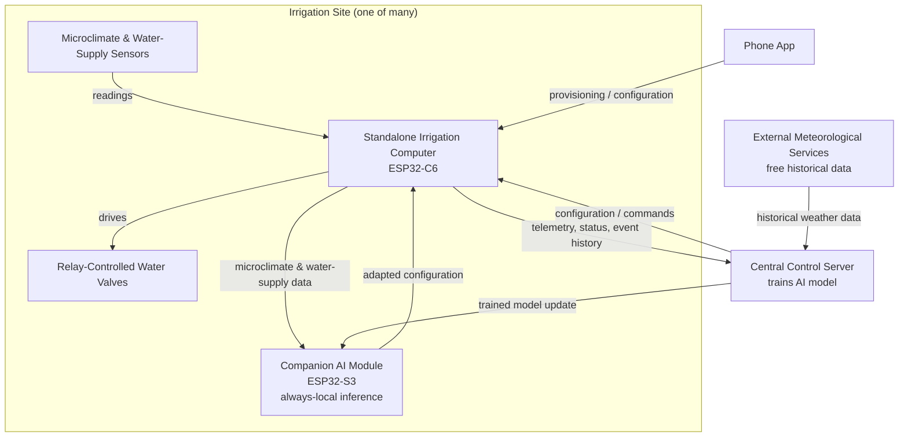
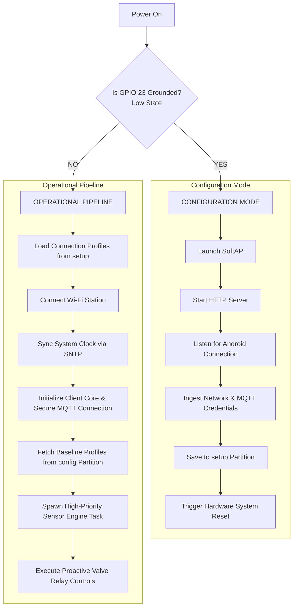
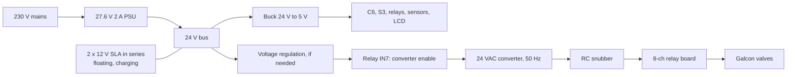
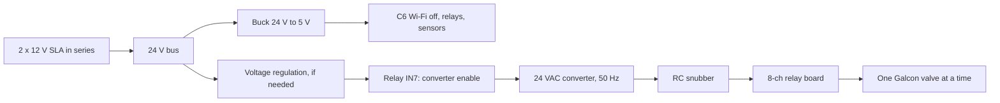
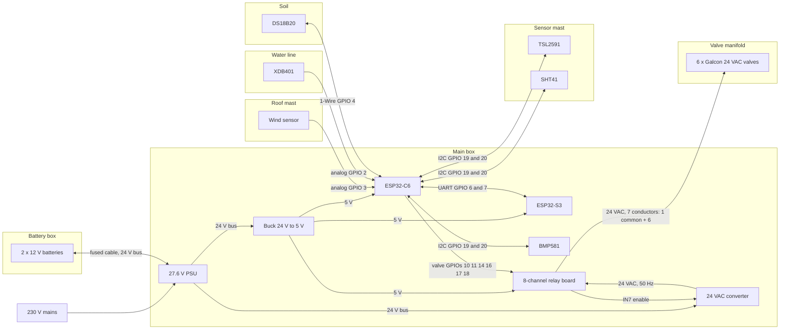

# Smart Irrigate — High-Level Design 

---
* Project state: ***construction & sandbox***
 
## Table of Contents

* [Project Description](#project-description)
  * [System Tiers](#system-tiers)
  * [Setup & Operational Mode](#setup--operational-mode)
* [High-Level Operational Logic Diagram](#high-level-operational-logic-diagram)
* [Core Concepts & Operational Logic](#core-concepts--operational-logic)
  * [Predictive & Macro-Environmental Irrigation Control](#predictive--macro-environmental-irrigation-control)
  * [Hydraulic Feedback & Healing (Zero-Pressure Handling)](#hydraulic-feedback--healing-zero-pressure-handling)
  * [Multi-Valve Scheduling & Compile-Time Constraints](#multi-valve-scheduling--compile-time-constraints)
* [Power Architecture](#power-architecture)
  * [Power paths](#power-paths)
  * [Behaviour by state](#behaviour-by-state)
  * [Parts and where they are used](#parts-and-where-they-are-used)
  * [Estimated power (battery side)](#estimated-power-battery-side)
  * [Open decisions](#open-decisions)
* [Physical Placement: Separate Enclosures](#physical-placement-separate-enclosures)
  * [Connection overview](#connection-overview)
* [Project Configuration](#project-configuration)
  * [Hardware Pin Configurations](#hardware-pin-configurations)
  * [Network & Protocol Configurations](#network--protocol-configurations)
  * [Storage & Partition Layout Architecture](#storage--partition-layout-architecture)

## Project Description
**Smart Irrigate** is an automated, low-power irrigation controller engineered for the **ESP-IDF 6.0 framework** running on the ESP32-C6 FireBeetle 2 platform. The device acts as an intelligent edge-computing node that monitors microclimate variables, tracks live hydraulic line pressure data, and manages a matrix of physical AC water valves using an external relay array.

### System Tiers
Smart Irrigate is designed to operate as a three-tier system, from a fully autonomous single unit up to a fleet managed by a central control server:
* **Standalone Irrigation Computer:** The ESP32-C6 unit described above can run entirely on its own. It accepts a configuration (valve schedules, environmental baselines, thresholds) pushed from a phone app during provisioning or from a server over MQTT, and independently drives the valve relays according to that configuration and its own sensor readings — no continuous connection to a backend is required for it to keep irrigating correctly.
* **Companion AI Module (ESP32-S3):** A second, chained ESP32-S3 module collects the microclimate and water-supply data streamed by the irrigation computer and runs local AI/ML inference to adapt the irrigation configuration to observed and forecast weather conditions. Inference always runs standalone on the ESP32-S3 itself — it does not require the central server to function. The model it runs, however, is trained offline on an external server, using telemetry collected from the station together with free historical data pulled from existing meteorological services; the trained model is then pushed down to the ESP32-S3 for local inference.
* **Central Control Server:** A backend service capable of managing a fleet of many standalone irrigation computers simultaneously. It ingests each unit's microclimate telemetry, status, and irrigation event history over MQTT, and can push updated configurations to any unit. It also coordinates with each unit's companion AI module, updating the AI's plan when broader, cross-site or historical data (e.g. regional weather trends) warrants a change beyond what the local AI module alone would decide.
  * It is possible to use only a single device with central control server. 

```mermaid
graph TD
    Phone[Phone App]
    Server[Central Control Server<br/>trains AI model]
    MetSvc[External Meteorological Services<br/>free historical data]

    subgraph Site["Irrigation Site (one of many)"]
        IC[Standalone Irrigation Computer<br/>ESP32-C6]
        AI[Companion AI Module<br/>ESP32-S3<br/>always-local inference]
        Valves[Relay-Controlled Water Valves]
        Sensors[Microclimate & Water-Supply Sensors]

        Sensors -- readings --> IC
        IC -- drives --> Valves
        IC -- microclimate & water-supply data --> AI
        AI -- adapted configuration --> IC
    end

    Phone -- provisioning / configuration --> IC
    Server -- configuration / commands --> IC
    IC -- telemetry, status, event history --> Server
    MetSvc -- historical weather data --> Server
    Server -- trained model update --> AI
```
   
### Setup & Operational Mode 
The software architecture leverages ESP-IDF 6.0 optimizations—such as the memory-efficient **Picolibc standard library**—to run proactive edge-logic routines. Smart Irrigate transitions between two software-controlled lifecycles evaluated at boot time:
* **Setup Mode:** Triggered manually by holding down a physical button interface during boot. The device suspends monitoring and spins up a native local Wi-Fi Access Point (SoftAP) alongside an **HTTP server** (`esp_http_server`). A dedicated Android app connects directly to this host network, exchanging structured string payloads to populate network credentials and MQTT infrastructure layouts. The HTTP server parses these properties, commits them into a dedicated Non-Volatile Storage (NVS) communication partition, and issues a hardware system restart.
* **Operational Mode:** The standard execution pathway. The device extracts connection profiles from the communication NVS partition, connects to the network via Wi-Fi Station mode, updates its clock via SNTP, and establishes a persistent, secure session with an upstream MQTT broker. A real-time engine concurrently samples physical data from the sensor array, packages the values, and streams them to the broker. Concurrently, the system acts upon incoming remote valve command structures, logging execution timelines and tracking irrigation events in real time.

## High-Level Operational Logic Diagram

```mermaid
graph TD
    A[Power On] --> B{Is GPIO 23 Grounded?<br>Low State}
    
    B -- YES --> C[CONFIGURATION MODE]
    B -- NO  --> D[OPERATIONAL PIPELINE]
    
    subgraph Configuration Mode
        C --> C1[Launch SoftAP]
        C1 --> C2[Start HTTP Server]
        C2 --> C3[Listen for Android Connection]
        C3 --> C4[Ingest Network & MQTT Credentials]
        C4 --> C5[Save to setup Partition]
        C5 --> C6[Trigger Hardware System Reset]
    end
    
    subgraph Operational Pipeline
        D --> D1[Load Connection Profiles from setup]
        D1 --> D2[Connect Wi-Fi Station]
        D2 --> D3[Sync System Clock via SNTP]
        D3 --> D4[Initialize Client Core & Secure MQTT Connection]
        D4 --> D5[Fetch Baseline Profiles from config Partition]
        D5 --> D6[Spawn High-Priority Sensor Engine Task]
        D6 --> D7[Execute Proactive Valve Relay Controls]
    end
```

## Core Concepts & Operational Logic

### Predictive & Macro-Environmental Irrigation Control
Smart Irrigate explicitly avoids relying on a high density of localized ground moisture probes. Because ground sensors only reflect moisture in a very localized, narrow radius, they fail to account for the broader macro-environmental variables driving true plant transpiration and soil evaporation. Instead, this system utilizes an advanced atmospheric and thermal tracking approach to calculate total water demand:
* **Evapotranspiration & Microclimate Analysis:** Rather than measuring stagnant ground moisture, the device continuously samples ambient air temperature, relative humidity (via the SHT41), and barometric pressure (via the BMP581). By combining these real-time data streams, the system monitors the vapor pressure deficit (VPD) and thermal conditions that directly influence how fast plants lose water and how quickly the ground dries up.
* **Solar Load Quantification:** To prevent identical watering behaviors on overcast versus clear days, the system utilizes a high-dynamic-range digital light sensor (TSL2591) to capture both visible and infrared light intensities. This real-time solar irradiance data allows the edge logic to accurately model solar energy accumulation across the landscape zone.
* **Thermal Inertia & Soil Mass Tracking:** A ruggedized, single-point digital thermometer (DS18B20) is deployed just below the topsoil layer. This serves as a thermal anchor, tracking core soil temperature trends against rapid shifts in air temperature to accurately determine evaporation behavior influenced by soil thermal mass.
* **Boundary Layer Wind Dynamics (Active Analog Processing):** To account for wind stripping away the humid air layer around leaves and increasing plant water loss, the system actively processes live wind speed metrics. An analog wind sensor continuously tracks ambient velocities up to 30 meters per second with a high-accuracy resolution of 0.1 meters per second. The edge logic combines this velocity data with local temperature and humidity readings, automatically increasing watering durations during windy periods to compensate for faster soil drying.
* **Barometric Weather Prediction & Seasonal Inflection Tracking:** The system monitors short-term barometric pressure tendencies using the BMP581 to anticipate regional rain fronts, adjusting upcoming irrigation volumes dynamically. On a macro-scale, the device cross-references its real-time atmospheric tracking with historical trends sent via the MQTT broker to map seasonal inflections (e.g., changes in solar intensity, regional winds, and seasonal dry spells). This atmospheric data profile allows the system to accurately predict landscape water depletion across the entire zone without deploying numerous spot-checking ground probes.
* **Environmental Compensation (Adaptive Volume):** The system evaluates live atmospheric metrics against the baseline parameters received in the MQTT configuration profile. If measured air temperature or solar load exceeds, or relative humidity drops significantly below the expected thresholds, the edge logic dynamically increases or decreases the calculated watering duration to compensate for altered soil evaporation rates.

### Hydraulic Feedback & Healing (Zero-Pressure Handling)
* If the system opens a relay to actuate a valve but the XDB401 transmitter reports a **"No Water Pressure"** state (indicating a dry main line, pump failure, or supply cutoff), the controller proactively shuts down the valve to protect hardware and avoid dry cycling.
* It logs a specific fault event to the MQTT tracking server.
* The system then automatically defers the irrigation cycle, constantly or periodically polling the line until water pressure is detected again, at which point it safely resumes the deferred watering routine later on.

### Multi-Valve Scheduling & Compile-Time Constraints
The device natively manages a matrix of **6 independent physical water valves**, each governed by its own independent logic pathway:
* **Independent Water Events:** The system tracks up to **6 distinct optional water events per valve** (totaling up to 36 distinct schedulable runtime blocks across the device). Each event is evaluated against incoming MQTT operational profiles and adjusted by the macro-environmental compensation engine.
* **Compile-Time Hardware Constraints:** Because the hardware layout binds each independent valve relay to a dedicated physical microcontroller pin, the GPIO mapping is rigidly locked into the project's compilation layer using **ESP-IDF Kconfig (`Kconfig.projbuild`)**. Modifying or shifting these pin allocations requires rebuilding the firmware via the build system, safeguarding the running application from runtime pin conflicts or accidental software rewires.

---

## Power Architecture

> **Status: design under evaluation.** Nothing here is built yet. Power figures are datasheet-typical estimates, not measurements. Items marked **TBD** are open decisions.

The valves are **24 VAC Galcon solenoids** (0.30 A inrush, 0.19 A holding, ~2.1 W real power, 7.2 VA inrush / 4.6 VA holding). They must keep watering when mains is lost, so the whole system runs from a single **24 V DC bus** that a mains PSU feeds and a battery backs up. A DC-to-AC converter (part not selected yet) turns the bus into the 50 Hz 24 VAC the valves need. No 230 V-to-24 V transformer and no 230 V inverter is used.

### Power paths

**Mains present (non-battery state)**

```mermaid
graph LR
    M[230 V mains] --> PSU[27.6 V 2 A PSU]
    PSU --> BUS[24 V bus]
    BAT[2 x 12 V SLA in series<br/>floating, charging] --- BUS
    BUS --> BUCK5[Buck 24 V to 5 V]
    BUCK5 --> LOGIC[C6, S3, relays, sensors, LCD]
    BUS --> BUCK24[Voltage regulation, if needed]
    BUCK24 --> EN[Relay IN7: converter enable]
    EN --> ACB[24 VAC converter, 50 Hz]
    ACB --> SNUB[RC snubber]
    SNUB --> RELAYS[8-ch relay board]
    RELAYS --> V[Galcon valves]
```

**Battery (mains lost)**

```mermaid
graph LR
    BAT[2 x 12 V SLA in series] --> BUS[24 V bus]
    BUS --> BUCK5[Buck 24 V to 5 V]
    BUCK5 --> LOGIC[C6 Wi-Fi off, relays, sensors]
    BUS --> BUCK24[Voltage regulation, if needed]
    BUCK24 --> EN[Relay IN7: converter enable]
    EN --> ACB[24 VAC converter, 50 Hz]
    ACB --> SNUB[RC snubber]
    SNUB --> RELAYS[8-ch relay board]
    RELAYS --> V[One Galcon valve at a time]
```

The battery floats across the bus at all times, so a mains loss causes no switch-over: the loads simply keep drawing from the battery.

### Behaviour by state

| | Mains present | Battery |
|---|---|---|
| Wi-Fi / SNTP / MQTT | On | **Off** (local schedule from the `config` partition, RTC clock) |
| ESP32-S3 companion | On | **Off** |
| Valves open at once | set by `DEVICE_MAX_SIMULTANEOUS_OPEN_VALVES` (menuconfig under "Main Power ON", default 2, range 2-16; design range 2-4), starts staggered ~0.5 s | **1**, time-sliced round robin: each valve gets a slice of at most `DEVICE_MAX_ROUND_ROBIN_TIME_MINI` minutes (menuconfig under "Main Battery ON", default 10, range 5-30), then the next valve with remaining time, until all counters reach zero |
| Valve switch order | Close old, wait ~1 s, open next (one-valve mode) | Same |
| LCD2004 | Wakes on button, off after N minutes | **Off** |
| Status LED (`GPIO_LED`) | Startup errors only | Startup errors only |
| Battery indicator | Off | Slow-blink LED (pin **TBD**) |
| 24 VAC converter | Enabled only while a valve is open | Enabled only while a valve is open |

### Parts and where they are used

| Part | Role | Mains | Battery |
|---|---|---|---|
| FireBeetle 2 ESP32-C6 | Main controller | Yes | Yes (Wi-Fi off) |
| ESP32-S3 DevKitC-1 | Companion AI module | Yes | **No** |
| 8-channel 5 V relay module | Valve switching (6 used), IN7 = converter enable, IN8 spare | Yes | Yes |
| 6 x Galcon 24 VAC solenoid valves | Water valves | Yes | Yes (1 at a time) |
| 230 V to 27.6 V, 2 A PSU | Feeds the bus, charges the battery | Yes | **No** (absent) |
| 2 x 12 V SLA battery in series | Backup (24 V) | Yes (floating) | Yes (sole source) |
| Battery fuse and low-voltage disconnect (~21 V) | Protection | Yes | Yes |
| Buck converter 24 V to 5 V (35 V rated) | Logic supply | Yes | Yes |
| Voltage regulation stage (needed only if the converter output follows its input) | Holds valve voltage at 24 Vrms from the 27.6 V bus | Yes | Yes (bus <= 25.6 V; must not drop below ~21 Vrms at the valves) |
| 24 VAC converter (DC-to-AC, part not selected) | Makes 50 Hz 24 VAC for the valves. Requirements: input range covers the 21-27.6 V bus, 24 Vrms output, 1 A continuous (4 valves holding), 2 A peak (inrush), enable input or switchable supply, short-circuit protection | Yes | Yes |
| RC snubber (~0.1 uF + 47-100 ohm), shared | Edge softening, relay contact protection | Yes | Yes |
| Fuses (converter input, 24 V side) | Protection | Yes | Yes |
| Mains-detect input (PSU DC-OK or optocoupler) | Selects the mode | Yes | Yes |
| Battery-voltage sense (ADC divider) | Low-battery warning | Yes | Yes |
| BMP581, SHT41, TSL2591 (I2C) | Weather sensors | Yes | Yes |
| DS18B20 (1-Wire) | Soil temperature | Yes | Yes |
| XDB401 pressure transmitter | Line pressure and no-water check | Yes | Yes |
| Wind sensor (0-5 V) | Wind speed | Yes | Yes |
| LCD2004 with I2C backpack | Local display | Yes (on request) | **No** |
| LCD wake button, LCD power switch | Display control | Yes | No |
| Status LED (`GPIO_LED`) | Startup error indicator | Yes | Yes (errors only) |
| Battery-state LED (slow blink) | Shows battery mode | No | Yes |
| Config switch (GPIO 23) | Boot into Configuration Mode | Boot only | **Ignored** |

**Not used in either path:** a 230 V to 24 VAC transformer, a 12 V to 230 V inverter, a mains/inverter changeover relay, a series DC-blocking capacitor, and the FireBeetle's own Li-ion charger (it only handles a single 3.7 V cell).

### Estimated power (battery side)

| State | Draw |
|---|---|
| Battery idle (Wi-Fi off, LCD off, converter off) | ~0.4 W |
| Battery, one valve open | ~3-4 W (valve ~2.1 W plus converter and relay losses) |
| Mains, 2-4 valves open, electronics on | PSU needs ~2 A at 27.6 V including recharge |

Battery sizing for 12 h idle plus 3 h of one valve is about 13 Wh usable, so two 12 V 4 Ah batteries in series leave generous margin.

### Open decisions
* **TBD:** how the 24 VAC converter regulates the valve voltage (built into the converter, or a separate stage).
* **TBD:** select the 24 VAC converter. It must produce an acceptable waveform and voltage for the Galcon valves (run cool and quiet) and have an enable control. A square wave is acceptable if the valves tolerate it; otherwise use a sine-modulated H-bridge on a 36-42 V bus, or a 12 V sine inverter feeding a 24 V transformer.
* **TBD:** GPIOs for the mains-detect input, battery sense, LCD wake button, LCD power switch and battery LED. Used pins: 2 and 3 (ADC), 4, 5, 6, 7, 10, 11, 14, 15, 16, 17, 18, 19, 20, 23. Check the board's available pins before choosing.

## Physical Placement: Separate Enclosures

The components do not share one box. Placement is decided by what each part can survive outdoors (heat, rain, cold), and by what it needs to measure correctly. Parts that are not weatherproof go in a protected box, parts that must be outside to measure correctly get their own housing, and parts that are weatherproof as bought are mounted outside with no box.

| Box | Contents | Location | Housing and notes |
|---|---|---|---|
| **Main box** | ESP32-C6, ESP32-S3, BMP581, 8-channel relay board, 27.6 V PSU, buck converter to 5 V, 24 VAC converter, fuses | Indoors or a sheltered spot | Sealed. 230 V side kept apart from the low-voltage side. BMP581 needs a small vent to outside air. |
| **Battery box** | 2 x 12 V batteries (series) | Next to the main box | Vented to open air, shaded and cool. Short fused cable to the main box through a gland. Lead-acid gives off hydrogen when charging, so keep it out of the main box. |
| **Sensor mast** | TSL2591 (top, sealed dome facing up), SHT41 (lower, ventilated radiation shield) | Outdoors, at least 1 m above the roof, clear sky view | Housings at least 30 cm apart. One short shared I2C cable. SHT41 in shade with free airflow. |
| **Roof mast (no box)** | Wind sensor | Roof, 1-2 m above the ridge, clear of the other housings | Weatherproof as bought. Pole mounted, level, with a drip loop in the cable. |
| **Soil (no box)** | DS18B20 | Irrigated zone, 5-10 cm deep | Waterproof probe in a sealed sleeve. Strain relief at the surface. |
| **Water line (no box)** | XDB401 | Tee near the manifold | Threaded fitting, upright or sideways. Add an isolation valve. |

### Connection overview

```mermaid
graph LR
    MAINS[230 V mains]

    subgraph MAIN["Main box"]
        PSU[27.6 V PSU]
        BUCK5[Buck 24 V to 5 V]
        CONV[24 VAC converter]
        C6[ESP32-C6]
        S3[ESP32-S3]
        BMP[BMP581]
        RELAY[8-channel relay board]
    end

    subgraph BATBOX["Battery box"]
        BAT[2 x 12 V batteries]
    end

    subgraph MAST["Sensor mast"]
        TSL[TSL2591]
        SHT[SHT41]
    end

    subgraph ROOF["Roof mast"]
        WIND[Wind sensor]
    end

    subgraph SOIL["Soil"]
        DS[DS18B20]
    end

    subgraph PIPE["Water line"]
        XDB[XDB401]
    end

    subgraph MANIFOLD["Valve manifold"]
        VALVES[6 x Galcon 24 VAC valves]
    end

    MAINS --> PSU
    PSU -- 24 V bus --> BUCK5
    PSU -- 24 V bus --> CONV
    BAT <-- "fused cable, 24 V bus" --> PSU
    BUCK5 -- 5 V --> C6
    BUCK5 -- 5 V --> S3
    BUCK5 -- 5 V --> RELAY
    C6 <-- "UART GPIO 6 and 7" --> S3
    C6 <-- "I2C GPIO 19 and 20" --> BMP
    C6 <-- "I2C GPIO 19 and 20" --> TSL
    C6 <-- "I2C GPIO 19 and 20" --> SHT
    WIND -- "analog GPIO 3" --> C6
    XDB -- "analog GPIO 2" --> C6
    DS <-- "1-Wire GPIO 4" --> C6
    C6 -- "valve GPIOs 10 11 14 16 17 18" --> RELAY
    RELAY -- "IN7 enable" --> CONV
    CONV -- "24 VAC, 50 Hz" --> RELAY
    RELAY -- "24 VAC, 7 conductors: 1 common + 6" --> VALVES
```

The 24 V bus carries power from the PSU to the battery, and from the battery to the loads during an outage (see "Power Architecture"). The relay board switches the 24 VAC from the converter to each valve.

---

## Project Configuration

### Hardware Pin Configurations
The physical hardware mapping on the ESP32-C6 micro-controller uses compile-time variables defined via Kconfig:
* **System Boot Switch:** **GPIO 23**. Configured as a digital input relying on internal pull-up resistors. A logical `LOW` reading recorded during the power-on sequence intercepts standard execution loops to force execution into Configuration Mode.
* **Shared I2C Bus:** **GPIO 19 (SDA)** and **GPIO 20 (SCL)**. This digital serial bus multiplexes data extraction lines from the local environment sensors.
  * *SHT41 Sensor:* Provides precision ambient temperature and relative humidity parameters via fixed I2C signaling.
  * *BMP581 Sensor:* Transmits targeted barometric pressure metrics and ambient temperature data.
  * *TSL2591 Sensor:* Measures high-resolution visible and infrared light spectrum intensities to calculate real-time solar irradiance load.
  * *Note:* All three sensors function on the exact same physical GPIO 19 and 20 paths, utilizing unique factory hardware address layers to prevent data line collisions.
* **1-Wire Serial Interface:** **GPIO 4**. Configured as an open-drain bidirectional digital line with a dedicated external pull-up resistor.
  * *DS18B20 Sensor:* Provides high-accuracy underground soil thermal parameters using the precision timing 1-Wire protocol.
* **Analog Interface Architecture:** The system uses two independent analog input channels to gather real-time data from physical equipment.
  * *XDB401 Pressure Transmitter (GPIO 2):* Interfaced directly to the primary analog channel. It records real-time water line pressure values, using hardware conditioning to scale raw output signals down to fit within safe internal limits.(ADC1_CH2)
  * *Analog Wind Speed Sensor (GPIO 3):* Interfaced directly to the secondary analog channel. Because the sensor outputs a 0–5V range, an external voltage divider circuit steps the incoming voltage down to a safe, readable level. The software maps this reading back to the true 0.0–30.0 meters per second wind speed curve.(ADC1_CH3)
* **Inter-Chip Link (ESP32-S3 Connection):** **GPIO 6 (TX)** and **GPIO 7 (RX)**. A UART link connecting the FireBeetle 2 to a companion ESP32-S3 module, with GPIO 6 wired to the ESP32-S3's RX pin and GPIO 7 to its TX pin.

### Network & Protocol Configurations
The network architecture is configured natively under the revised ESP-IDF 6.0 components using the following specifications:
* **Wi-Fi Subsystem:** Tailored to exploit the ESP32-C6 radio. It hooks into the global `esp_event` loop framework to transition automatically between the SoftAP + HTTP server configuration topology and the automated Station network connector profile.
* **Internet Time Synchronization (SNTP):** Utilizing the native **`esp_netif_sntp` framework** optimized in ESP-IDF 6.0. Upon establishing an active station connection in Operational Mode, the system queries public Network Time Protocol (NTP) pools via network sockets to configure and adjust the internal hardware Real-Time Clock (RTC). This guarantees millisecond-accurate scheduling logs and execution timestamps for all 36 optional irrigation events without needing a local hardware RTC battery module.
* **MQTT Client Configuration:** Powered by the core communication component, it parses data over two primary pipelines:
    * *Telemetry & Event Topic (Outbound):* A target path used to broadcast serialized data detailing live water pressure, wind speed in meters per second from GPIO 3, ambient temperature, humidity, and immediate valve state event logs.
    * *Command/Configuration Topic (Inbound):* A real-time subscription pathway that intercepts remote instructions, environmental baseline thresholds, historical seasonal data packets, and the 6-event scheduler layouts for each of the 6 compiled valves.

### Storage & Partition Layout Architecture
To optimize access speed, reduce wear overhead, and safely isolate temporary networking properties from large irrigation parameters, flash memory storage is separated into distinct custom partitions within the `partitions.csv` topology:
* **Communications NVS Partition (`setup`):** A dedicated, standard key-value NVS flash space strictly reserved for storing Wi-Fi credentials (SSID, Password), security flags, SNTP server pool parameters, and primary MQTT broker socket configuration strings. This partition is exclusively rewritten during Configuration Mode.
* **Irrigation Storage Data Partition (`config`):** A separate, dedicated data flash partition optimized to hold complex valve schedule configurations, the 36 optional irrigation events, dynamic operational parameters, and historical wind and environmental baseline metrics.
